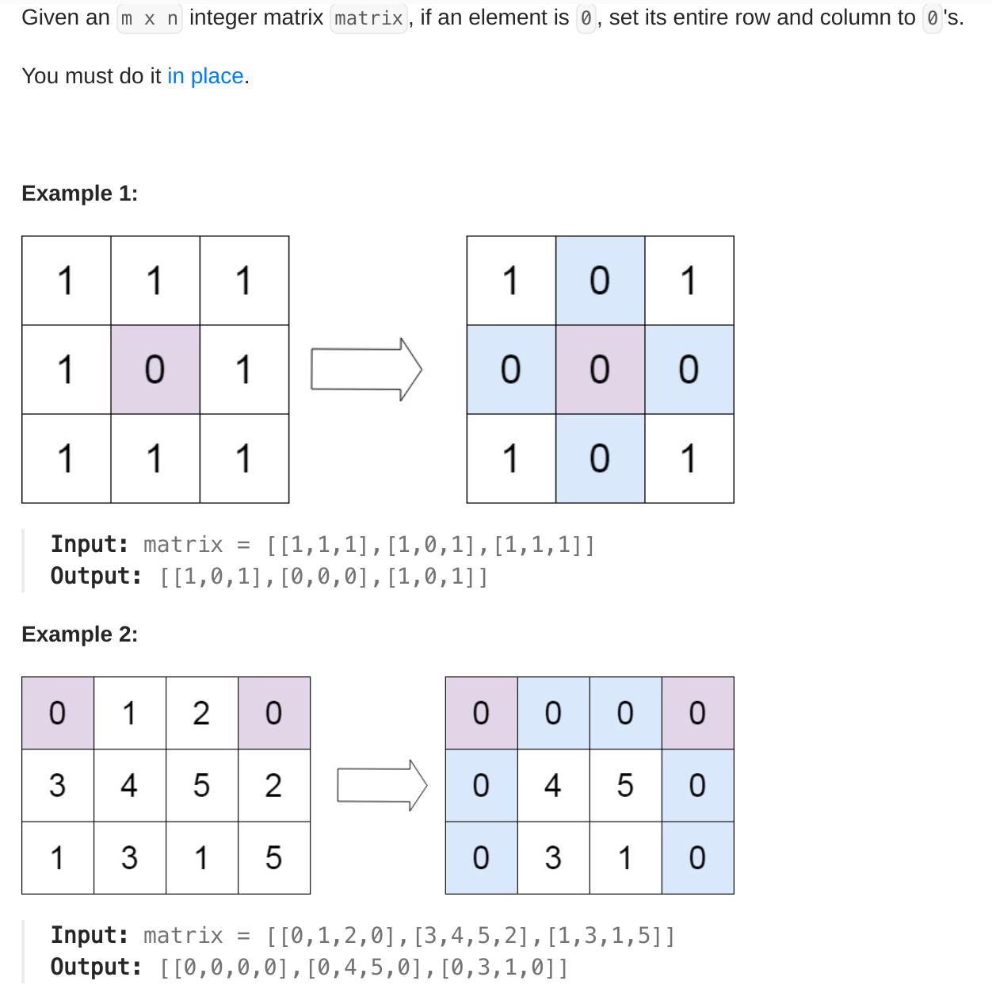
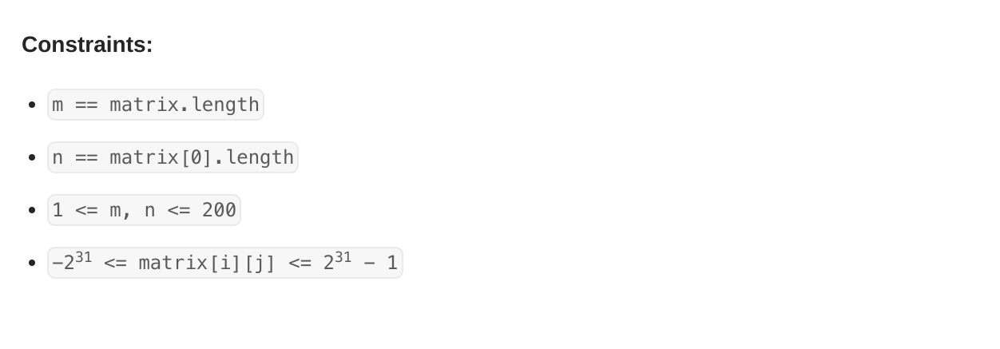

# LeetCode Problem 73 - Set Matrix Zeroes

## Problem

## My First Approach 

> Time complexity O(m*n)
> Space complexity O(max(m,n)) 

### Intuition 

- Create two boolean array for marking row and coloum containing zero.
- Iterate over matrix if any value is zero mark row and col of boolean array as true.
- Iterate boolean array of row if true found set all value of particular row in matrix as zero and apply same for coloumn boolean array

[Solution](../LeetCode/LC-73-Set-Matrix-Zeroes/BruteForceSolution.java)

